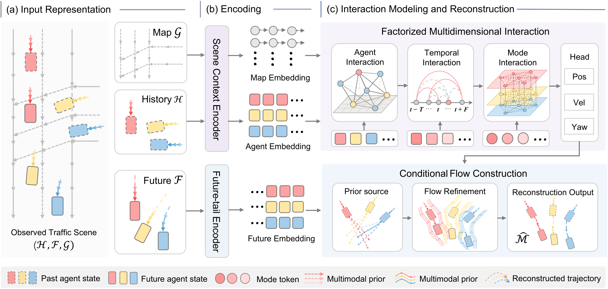

# TrajBridge

Official Repository for: **Future-Constrained Conditional Flow Bridge for Multi-Agent Trajectory Reconstruction in Dense Traffic**

## 📌 Status

This paper is currently **under review**. 
The code, models, and full documentation **will be open-sourced upon acceptance**.

## 📄 Overview

  

## 📅 News

- **[2026.09.16]** Repository created. Paper submitted for review.

## 🚀 Coming Soon

Once the paper is accepted, we will release:
- Full training and evaluation code
- Pretrained model weights
- Data preprocessing scripts
- Detailed reproduction instructions

## 📝 Citation

The citation information will be updated upon acceptance. Please stay tuned.

## 📬 Contact

For any questions or discussions, please open an issue in this repository.
